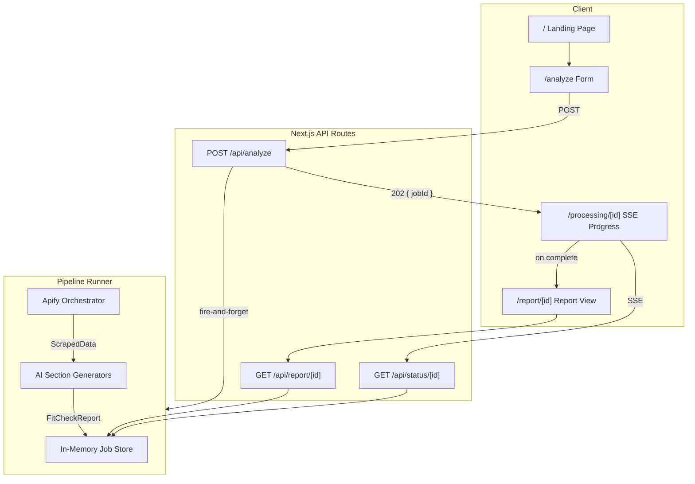

# FitCheck

AI-powered brand perception and ideal customer profile analysis, grounded in live web data.

FitCheck scrapes your website, competitors, reviews, social mentions, and public discussions using [Apify](https://apify.com), then runs five parallel AI analyses to produce an evidence-backed report with actionable branding and positioning recommendations.

## Features

- **Brand Perception Analysis** — tone, perceived strengths, weak signals, and a consistency score derived from your site and public mentions
- **Ideal Customer Profile (ICP) Assessment** — data-driven personas ranked by fit, with inferred pain points, motivations, and buying triggers
- **Brand Direction Actionables** — concrete recommendations: what to improve, what to change, what to lean into, with before/after copy suggestions
- **Customer & Lead Suggestions** — target customer types, communities, companies, and creator channels worth reaching
- **ICP Studio** — AI-generated personas with simulated 5-second reactions to your homepage and pain-point gap analysis

## Quickstart

```bash
git clone <repo-url> && cd CreateYourOwnLuck
npm install
cp .env.example .env.local
# Fill in API keys (see Environment Variables below)
npm run dev
```

Open [http://localhost:3000](http://localhost:3000).

## Environment Variables

Create `.env.local` from `.env.example`:

| Variable | Required | Description |
|---|---|---|
| `APIFY_TOKEN` | Yes | Apify API token — powers all web scraping |
| `AI_PROVIDER` | Yes | `anthropic`, `openai`, or `gemini` |
| `ANTHROPIC_API_KEY` | If provider is `anthropic` | Key for Claude (`claude-sonnet-4-6`) |
| `OPENAI_API_KEY` | If provider is `openai` | Key for GPT-4o |
| `GEMINI_API_KEY` | If provider is `gemini` | Key for Gemini 2.5 Pro |

## How It Works

### User Flow

1. **Submit company info** — company name and website URL (required)
2. **Add materials** (optional) — paste pitch decks, marketing copy, product docs
3. **Add competitors** (optional) — up to 3 competitor URLs
4. **State a goal** (optional) — e.g. "We want to move upmarket"
5. **Watch the analysis** — real-time progress via SSE shows each pipeline stage
6. **Review the report** — tabbed, interactive report with five sections

### Architecture



### Pipeline Detail

The pipeline runs as a fire-and-forget async function triggered by `POST /api/analyze`. Progress updates stream to the client via SSE at `GET /api/status/[id]`.

**Stage 1 — Web Scraping (parallel via Apify)**

All 10 Apify tasks run concurrently using `Promise.allSettled`. Individual failures produce warnings but never crash the pipeline.

| Apify Actor | Data Collected | Limits |
|---|---|---|
| `apify/website-content-crawler` | Company site pages as markdown | 8 pages, Cheerio crawler |
| `apify/website-content-crawler` | Competitor site pages | 4 pages per competitor |
| `apify/google-search-scraper` | Reddit, HN, G2, Trustpilot, news mentions | 8 results/query, 1 page |
| `apidojo/tweet-scraper` | Twitter/X mentions | 30 tweets |
| `misceres/g2-scraper` | Structured G2 reviews | 15 reviews |
| `epctex/trustpilot-scraper` | Structured Trustpilot reviews | 15 reviews |
| `helloitsjoe/linkedin-jobs-scraper` | Job postings (strategy signals) | 15 postings |
| `streamers/youtube-scraper` | YouTube videos about the brand | 10 results |
| `epctex/product-hunt-scraper` | Product Hunt launches | 5 entries |
| `emastra/google-autocomplete-scraper` | Autocomplete suggestions | US/English |

Scraped data is normalized (truncated to prevent context overflow, URLs deduplicated, mentions tagged by source) before passing to AI.

**Stage 2 — AI Analysis (parallel)**

Five section generators run concurrently via `Promise.allSettled`. Each uses the Vercel AI SDK's `generateObject` with Zod schemas for structured output:

| Section | Generator | Output |
|---|---|---|
| Brand Perception | `generateBrandPerception` | Tone, strengths, weak signals, consistency score |
| ICP Assessment | `generateIcpAssessment` | Customer profiles ranked by fit score |
| Actionables | `generateActionables` | Improvements, changes, messaging angles, copy suggestions |
| Lead Suggestions | `generateLeadSuggestions` | Customer types, communities, target companies, creator channels |
| ICP Studio | `generateIcpStudio` | Personas with 5-second reactions and pain-point gaps |

If any section fails, a fallback empty structure is used so the report still renders.

**Stage 3 — Report Assembly**

All sections are combined into a `FitCheckReport` and stored in the in-memory job store. Warnings from scraping and AI failures are included in the report.

## API Routes

| Method | Route | Status | Description |
|---|---|---|---|
| `POST` | `/api/analyze` | 202 | Accepts `{ companyName, websiteUrl, extraMaterials?, competitorUrls?, goal? }`. Returns `{ jobId }`. |
| `GET` | `/api/status/[id]` | 200 | SSE stream. Emits `StatusEvent` every 500ms until `complete` or `failed`. |
| `GET` | `/api/report/[id]` | 200/202/404 | Returns `FitCheckReport` (200), `{ status, progress }` (202 if pending), or 404. Supports `id=demo` for a built-in demo report. |

## Tech Stack

| Layer | Technology |
|---|---|
| Framework | Next.js 14 (App Router) |
| UI | Tailwind CSS + shadcn/ui + Radix primitives |
| Icons | Lucide React |
| Web Data | Apify (9 actors — see pipeline detail above) |
| AI | Vercel AI SDK (`ai` v4) with Anthropic / OpenAI / Google providers |
| Validation | Zod schemas for both API input and AI structured output |
| Real-time | Server-Sent Events (SSE) for progress tracking |
| State | In-memory `Map<string, AnalysisJob>` (resets on server restart) |
| Deploy | Vercel-ready (no custom config needed) |

## Project Structure

```
src/
├── app/
│   ├── page.tsx                    # Landing page — renders Hero
│   ├── layout.tsx                  # Root layout
│   ├── globals.css                 # Tailwind base + custom CSS variables
│   ├── analyze/page.tsx            # 4-step onboarding form
│   ├── processing/[id]/page.tsx    # SSE progress tracker
│   ├── report/[id]/page.tsx        # Tabbed report view
│   └── api/
│       ├── analyze/route.ts        # POST — start pipeline, return jobId
│       ├── status/[id]/route.ts    # GET — SSE stream of progress
│       └── report/[id]/route.ts    # GET — fetch completed report
├── lib/
│   ├── types.ts                    # All shared TypeScript types and constants
│   ├── utils.ts                    # cn() helper (clsx + tailwind-merge)
│   ├── apify/
│   │   ├── client.ts               # runActor() — Apify API wrapper (120s timeout)
│   │   ├── actors.ts               # Actor IDs + input builders for all 9 actors
│   │   ├── orchestrator.ts         # scrapeAll() — parallel scraping orchestration
│   │   └── normalizer.ts           # Raw Apify output → typed ScrapedData
│   ├── ai/
│   │   ├── provider.ts             # AI model selection + 5 section generators
│   │   └── prompts.ts              # Zod schemas + prompt builders + SYSTEM_PROMPT
│   └── pipeline/
│       ├── runner.ts               # runPipeline() — scrape → analyze → report
│       └── store.ts                # In-memory job store (Map-based)
└── components/
    ├── ui/                         # shadcn/ui primitives (button, card, badge, etc.)
    ├── landing/hero.tsx            # Landing page hero + feature grid
    ├── form/                       # Multi-step onboarding wizard
    │   ├── step-indicator.tsx      # Step progress indicator
    │   ├── company-info-step.tsx   # Step 1: company name + URL
    │   ├── materials-step.tsx      # Step 2: extra materials
    │   ├── competitors-step.tsx    # Step 3: competitor URLs
    │   └── goal-step.tsx           # Step 4: business goal
    ├── processing/
    │   └── progress-tracker.tsx    # Stage groups with animated status icons
    └── report/
        ├── report-header.tsx       # Company name, URL, date, share/export
        ├── brand-perception.tsx    # Brand Perception tab
        ├── icp-assessment.tsx      # ICP Assessment tab
        ├── actionables.tsx         # Actionables tab
        ├── lead-suggestions.tsx    # Lead Suggestions tab
        ├── icp-studio.tsx          # ICP Studio tab
        └── evidence-block.tsx      # Reusable evidence citation component
```

## Extending

- **Add a new AI provider** — add a branch in `getModel()` in `src/lib/ai/provider.ts`
- **Add a new report section** — define a Zod schema + prompt builder in `prompts.ts`, add a generator in `provider.ts`, add a stage to `PIPELINE_STAGES` in `types.ts`, wire it into `runner.ts`, and create a report component
- **Add a new data source** — add an actor ID and input builder in `actors.ts`, add a normalizer in `normalizer.ts`, add the scrape task in `orchestrator.ts`
- **Persistent storage** — replace the in-memory `Map` in `store.ts` with a database adapter

## Troubleshooting

| Problem | Cause | Fix |
|---|---|---|
| `APIFY_TOKEN is not set` | Missing env var | Add `APIFY_TOKEN` to `.env.local` |
| `ANTHROPIC_API_KEY is not set` | Missing API key for selected provider | Set the key matching your `AI_PROVIDER` value |
| Report shows empty sections | Individual AI section timed out or errored | Check the `warnings` array in the report JSON; retry the analysis |
| Scrape returned 0 pages | Target site blocks bots or URL is invalid | Verify the URL loads in a browser; some sites require JS rendering (Cheerio crawler is used by default) |
| Job state lost after restart | In-memory store does not persist | Expected for MVP; see Extending section for adding persistent storage |
| Pipeline hangs on Vercel | Serverless function times out before pipeline completes | Wrap `runPipeline()` in `waitUntil()` from `@vercel/functions` (noted in `route.ts`) |

## Scripts

```bash
npm run dev       # Start development server
npm run build     # Production build
npm run start     # Start production server
npm run lint      # Run ESLint
```

## License

MIT
