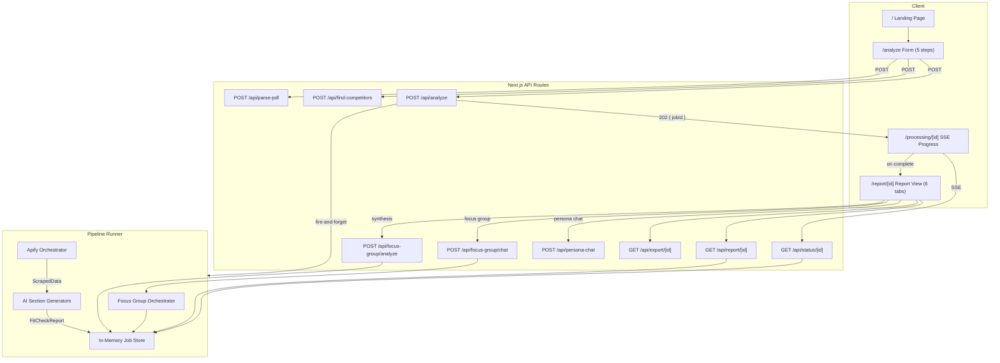

# FitCheck

AI-powered brand perception and ideal customer profile analysis, grounded in live web data.

FitCheck scrapes your website, competitors, reviews, social mentions, and public discussions using [Apify](https://apify.com), then runs parallel AI analyses to produce an evidence-backed report with actionable branding and positioning recommendations — plus a simulated focus group where AI personas debate your product in real time.

## Features

- **Brand Perception Analysis** — tone, perceived strengths, weak signals, and a consistency score derived from your site and public mentions
- **Ideal Customer Profile (ICP) Assessment** — data-driven personas ranked by fit, with inferred pain points, motivations, and buying triggers
- **Brand Direction Actionables** — concrete recommendations: what to improve, what to change, what to lean into, with before/after copy suggestions
- **Customer & Lead Suggestions** — target customer types, communities, companies, and creator channels worth reaching
- **ICP Studio** — AI-generated personas with simulated 5-second reactions to your homepage, pain-point gap analysis, and interactive persona chat
- **Focus Group Mode** — multi-agent orchestration where 2-3 AI personas participate in a structured discussion, probing your positioning and flipping to ask you questions, with market-weighted analytics synthesis
- **PDF Export** — downloadable dark-themed PDF report via `@react-pdf/renderer`
- **Source Selection** — choose which data sources to scrape (Google Search, reviews, Twitter/X, enrichment) or run all
- **AI Competitor Discovery** — auto-suggest competitor URLs from your company name and website
- **PDF Upload** — paste materials or upload a PDF pitch deck / marketing doc to include as brand context

## Quickstart

```bash
git clone <repo-url> && cd CreateYourOwnLuck
npm install
cp .env.example .env.local
# Fill in API keys (see Environment Variables below)
npm run dev
```

Open [http://localhost:3000](http://localhost:3000).

### Docker

```bash
docker build -t fitcheck .
docker run -p 3000:3000 --env-file .env.local fitcheck
```

## Environment Variables

Create `.env.local` from `.env.example`:

| Variable | Required | Description |
|---|---|---|
| `APIFY_TOKEN` | Yes | Apify API token — powers all web scraping |
| `AI_PROVIDER` | Yes | `anthropic`, `openai`, or `gemini` |
| `ANTHROPIC_API_KEY` | If provider is `anthropic` | Key for Claude (`claude-sonnet-4-6`) |
| `OPENAI_API_KEY` | If provider is `openai` | Key for GPT-4o |
| `GEMINI_API_KEY` | If provider is `gemini` | Key for Gemini 2.5 Pro |

## How It Works

### User Flow

1. **Submit company info** — company name and website URL (required)
2. **Add materials** (optional) — paste text or upload a PDF pitch deck / marketing doc
3. **Add competitors** (optional) — up to 3 competitor URLs, or auto-discover via AI
4. **Select data sources** (optional) — toggle Google Search, reviews, Twitter/X, and enrichment sources
5. **State a goal** (optional) — e.g. "We want to move upmarket"
6. **Watch the analysis** — real-time progress via SSE shows each of the 12 pipeline stages
7. **Review the report** — tabbed, interactive report with six sections
8. **Run a Focus Group** — probe personas, flip the conversation, and synthesize market-weighted analytics
9. **Export PDF** — download a styled PDF of the full report

### Architecture



### Pipeline Detail

The pipeline runs as a fire-and-forget async function triggered by `POST /api/analyze`. Progress updates stream to the client via SSE at `GET /api/status/[id]`.

**Stage 1 — Web Scraping (two-phase via Apify)**

Scraping runs in two phases. Phase 1 runs Google search first to discover real G2 product URLs. Phase 2 launches all remaining tasks in parallel via `Promise.allSettled`. Website crawlers run sequentially to stay within Apify's free-plan memory ceiling. Individual failures produce warnings but never crash the pipeline. Users can toggle which optional sources to include.

| Apify Actor | Data Collected | Limits |
|---|---|---|
| `apify/website-content-crawler` | Company site pages as markdown | 8 pages, 1024 MB, 180s timeout |
| `apify/website-content-crawler` | Competitor site pages | 4 pages per competitor, 1024 MB, 180s timeout |
| `apify/google-search-scraper` | Reddit, HN, G2, Trustpilot, news, TechCrunch, competitive comparison mentions | 8 results/query, 1 page/query |
| `apidojo/tweet-scraper` | Twitter/X mentions | 30 tweets |
| `zen-studio/g2-reviews-scraper` | Structured G2 reviews (URL discovered from Phase 1) | 15 reviews |
| `automation-lab/trustpilot-scraper` | Structured Trustpilot reviews (URL derived from company hostname) | 15 reviews |
| `streamers/youtube-scraper` | YouTube videos about the brand | 10 results |
| `damilo/google-autocomplete-apify` | Autocomplete suggestions | US/English |

Combined reviews (G2 + Trustpilot) are capped at 20. Scraped data is normalized (page content truncated to 8,000 chars, snippets to 500 chars, reviews to 300 chars, URLs deduplicated, mentions tagged by source) before passing to AI.

**Stage 2 — AI Analysis (parallel)**

Five section generators run concurrently via `Promise.allSettled`. Each uses the Vercel AI SDK's `generateObject` with Zod schemas for structured output (temperature 0.4):

| Section | Generator | Output |
|---|---|---|
| Brand Perception | `generateBrandPerception` | Tone, strengths, weak signals, consistency score |
| ICP Assessment | `generateIcpAssessment` | 1-3 customer profiles ranked by fit score, audience segments |
| Actionables | `generateActionables` | Improvements, changes, messaging angles, copy suggestions |
| Lead Suggestions | `generateLeadSuggestions` | Customer types, communities, target companies, creator channels |
| ICP Studio | `generateIcpStudio` | 2-3 personas with 5-second reactions and pain-point gaps |

If any section fails, a fallback empty structure is used so the report still renders.

**Stage 3 — Report Assembly**

All sections are combined into a `FitCheckReport` and stored in the in-memory job store. Warnings from scraping and AI failures are included in the report.

### Focus Group Mode

After the report is generated, the Focus Group tab lets you run a structured multi-persona discussion:

1. **Probe phase** — you submit a stimulus (headline, pricing page, positioning statement) and all personas react in character, informed by the same scraped evidence
2. **Flip phase** — personas take control and ask you questions about your product, surfacing objections and gaps
3. **Synthesis** — the full transcript is analyzed to produce market-weighted analytics: PMF score, ICP priority ranking, top objections, consensus signals, and recommended actions

Focus group sessions are stored in the in-memory store alongside analysis jobs.

## API Routes

| Method | Route | Status | Description |
|---|---|---|---|
| `POST` | `/api/analyze` | 202 | Accepts `{ companyName, websiteUrl, extraMaterials?, competitorUrls?, goal?, selectedSources? }`. Returns `{ jobId }`. |
| `GET` | `/api/status/[id]` | 200 | SSE stream. Emits `StatusEvent` every 500ms until `complete` or `failed`. |
| `GET` | `/api/report/[id]` | 200/202/404/500 | Returns `FitCheckReport` (200), status (202 if pending/running), error (500 if failed), or 404. Supports `id=demo` for a built-in demo report. |
| `GET` | `/api/export/[id]` | 200/202/404 | Generates and returns a PDF of the report. `maxDuration = 60`. |
| `POST` | `/api/find-competitors` | 200 | Accepts `{ companyName, websiteUrl }`. Returns `{ competitors: string[] }` (1-3 URLs). |
| `POST` | `/api/parse-pdf` | 200 | Accepts multipart `file` (PDF, max 10 MB). Returns `{ text: string }`. |
| `POST` | `/api/persona-chat` | 200 | Accepts `{ persona, message, history }`. Returns `{ reply: string }`. |
| `POST` | `/api/focus-group/chat` | 200 | SSE stream. Accepts `{ jobId, personas, stimulus?, phase?, sessionId?, isFlipInitiation? }`. Streams persona messages. |
| `POST` | `/api/focus-group/analyze` | 200 | Accepts `{ sessionId }`. Returns `FocusGroupAnalytics`. |

## Tech Stack

| Layer | Technology |
|---|---|
| Framework | Next.js 14 (App Router) |
| UI | Tailwind CSS + shadcn/ui + Radix primitives |
| Animations | Framer Motion |
| Charts | Recharts |
| Icons | Lucide React |
| Theming | next-themes (light/dark mode) |
| Web Data | Apify (7 actors — see pipeline detail above) |
| AI | Vercel AI SDK (`ai` v4) with Anthropic / OpenAI / Google providers |
| Validation | Zod schemas for API input and AI structured output |
| Real-time | Server-Sent Events (SSE) for progress tracking and focus group chat |
| PDF Export | `@react-pdf/renderer` (server-side rendering) |
| PDF Parsing | `unpdf` for extracting text from uploaded PDFs |
| State | In-memory `Map<string, AnalysisJob>` + `Map<string, FocusGroupSession>` (resets on server restart) |
| Deploy | Vercel-ready (`@vercel/functions` for `waitUntil`) or Docker |

## Project Structure

```
src/
├── app/
│   ├── page.tsx                    # Landing page — renders Hero
│   ├── layout.tsx                  # Root layout with ThemeProvider
│   ├── globals.css                 # Tailwind base + CSS variables + theme
│   ├── analyze/page.tsx            # 5-step onboarding form
│   ├── processing/[id]/page.tsx    # SSE progress tracker (12 stages)
│   ├── report/[id]/page.tsx        # Tabbed report view (6 tabs)
│   └── api/
│       ├── analyze/route.ts        # POST — start pipeline, return jobId
│       ├── status/[id]/route.ts    # GET — SSE stream of progress
│       ├── report/[id]/route.ts    # GET — fetch completed report (or demo)
│       ├── export/[id]/route.ts    # GET — generate and download PDF
│       ├── find-competitors/route.ts  # POST — AI competitor discovery
│       ├── parse-pdf/route.ts      # POST — extract text from uploaded PDF
│       ├── persona-chat/route.ts   # POST — single persona chat
│       └── focus-group/
│           ├── chat/route.ts       # POST — SSE focus group rounds
│           └── analyze/route.ts    # POST — synthesize focus group analytics
├── lib/
│   ├── types.ts                    # All shared TypeScript types and constants
│   ├── utils.ts                    # cn() helper (clsx + tailwind-merge)
│   ├── apify/
│   │   ├── client.ts               # runActor() — Apify API wrapper (120s default timeout)
│   │   ├── actors.ts               # Actor IDs + input builders for all 7 actors
│   │   ├── orchestrator.ts         # scrapeAll() — two-phase parallel scraping
│   │   └── normalizer.ts           # Raw Apify output → typed ScrapedData
│   ├── ai/
│   │   ├── provider.ts             # AI model selection + 5 section generators
│   │   ├── prompts.ts              # Zod schemas + prompt builders + SYSTEM_PROMPT
│   │   ├── focus-group.ts          # Focus group orchestration (probe/flip phases)
│   │   └── focus-group-analyze.ts  # Focus group transcript → market-weighted analytics
│   ├── pipeline/
│   │   ├── runner.ts               # runPipeline() — scrape → analyze → report (12 stages)
│   │   └── store.ts                # In-memory job store + focus group session store
│   └── pdf/
│       └── report-pdf.tsx          # @react-pdf document (dark terminal theme)
└── components/
    ├── ui/                         # shadcn/ui primitives (button, card, badge, input, label, progress, textarea)
    ├── landing/hero.tsx            # Landing page hero + feature grid + data sources + CTA
    ├── form/                       # Multi-step onboarding wizard
    │   ├── step-indicator.tsx      # Step progress indicator (5 steps)
    │   ├── company-info-step.tsx   # Step 1: company name + URL
    │   ├── materials-step.tsx      # Step 2: extra materials (text + PDF upload)
    │   ├── competitors-step.tsx    # Step 3: competitor URLs (+ AI auto-find)
    │   ├── sources-step.tsx        # Step 4: data source toggles
    │   └── goal-step.tsx           # Step 5: business goal
    ├── processing/
    │   └── progress-tracker.tsx    # 12-stage progress with animated status icons
    ├── report/
    │   ├── report-header.tsx       # Company name, URL, date, share/export PDF
    │   ├── brand-perception.tsx    # Brand Perception tab
    │   ├── icp-assessment.tsx      # ICP Assessment tab
    │   ├── actionables.tsx         # Actionables tab
    │   ├── lead-suggestions.tsx    # Lead Suggestions tab
    │   ├── icp-studio.tsx          # ICP Studio tab (personas + chat)
    │   ├── focus-group.tsx         # Focus Group tab (probe/flip chat UI)
    │   ├── focus-group-analytics.tsx  # Focus Group analytics (PMF score, charts)
    │   └── evidence-block.tsx      # Reusable evidence citation component
    ├── animated-logo.tsx           # Animated clover SVG brand mark
    ├── count-up.tsx                # Animated number counter
    ├── cursor-bloom.tsx            # Canvas cursor glow effect
    ├── neon-badge.tsx              # Badge with neon border
    ├── scanline-overlay.tsx        # CRT-style scanline/grain overlay (dark mode)
    ├── theme-provider.tsx          # next-themes ThemeProvider wrapper
    └── theme-toggle.tsx            # Light/dark mode toggle
```

## Extending

- **Add a new AI provider** — add a branch in `getModel()` in `src/lib/ai/provider.ts`
- **Add a new report section** — define a Zod schema + prompt builder in `prompts.ts`, add a generator in `provider.ts`, add a stage to `PIPELINE_STAGES` in `types.ts`, wire it into `runner.ts`, and create a report component
- **Add a new data source** — add an actor ID and input builder in `actors.ts`, add a normalizer in `normalizer.ts`, add the scrape task in `orchestrator.ts`
- **Persistent storage** — replace the in-memory `Map` in `store.ts` with a database adapter (covers both jobs and focus group sessions)
- **Add a new focus group phase** — extend `FocusGroupPhase` in `types.ts`, add orchestration logic in `focus-group.ts`, update the chat API route

## Troubleshooting

| Problem | Cause | Fix |
|---|---|---|
| `APIFY_TOKEN is not set` | Missing env var | Add `APIFY_TOKEN` to `.env.local` |
| `ANTHROPIC_API_KEY is not set` | Missing API key for selected provider | Set the key matching your `AI_PROVIDER` value |
| Report shows empty sections | Individual AI section timed out or errored | Check the `warnings` array in the report JSON; retry the analysis |
| Scrape returned 0 pages | Target site blocks bots or URL is invalid | Verify the URL loads in a browser; some sites require JS rendering (Cheerio crawler is used by default) |
| G2 scrape skipped | No G2 product page found in Google search results | G2 URLs are discovered from search, not guessed — the company may not have a G2 listing |
| Job state lost after restart | In-memory store does not persist | Expected for MVP; see Extending section for adding persistent storage |
| Pipeline hangs on Vercel | Serverless function times out before pipeline completes | Wrap `runPipeline()` in `waitUntil()` from `@vercel/functions` (noted in `route.ts`) |
| PDF export fails | `@react-pdf/renderer` needs server-side rendering | Ensure `apify-client`, `proxy-agent`, and `@react-pdf/renderer` are in `serverComponentsExternalPackages` in `next.config.js` |
| PDF upload fails | File exceeds 10 MB or is image-only | Reduce file size; `unpdf` cannot extract text from scanned/image-only PDFs |

## Scripts

```bash
npm run dev       # Start development server
npm run build     # Production build
npm run start     # Start production server
npm run lint      # Run ESLint
```

## License

MIT
